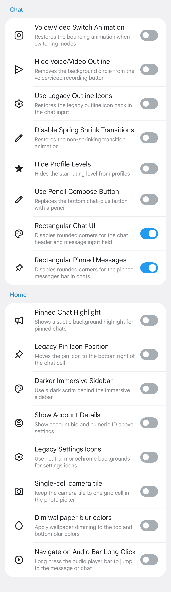
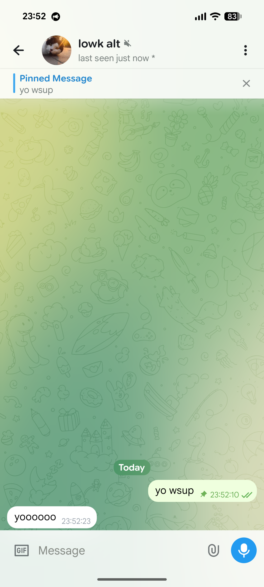

## aartzzUtils
*[Licensed under the GNU General Public License v3.0](LICENSE)*

Plugin for exteraGram aimed to port legacy functions, that removed in newer telegram versions for some reason.

[](https://t.me/fossSquad)
[](https://nightly.link/fossSquad/aartzzUtils/workflows/build/main?preview)

> [!WARNING]  
> Plugin in alpha test, except bugs.

### Screenshots
| | |
|---|---|
|  |  |
| Settings | legacy chat UI port |

### Building

**Requirements**
- Python 3.x

```bash
git clone https://github.com/fossSquad/aartzzUtils.git
cd aartzzUtils

python3 -m venv .venv
source .venv/bin/activate

# build plugin
elyb build -v -nf
```

Output will be at `builds` folder.

### Dev builds
Latest dev builds are available as CI artifacts.

### Credits
- [@lostywolfer](https://github.com/lostyawolfer) — concept
- [exteraGram](https://github.com/exteraSquad/exteraGram) — plugin runtime
